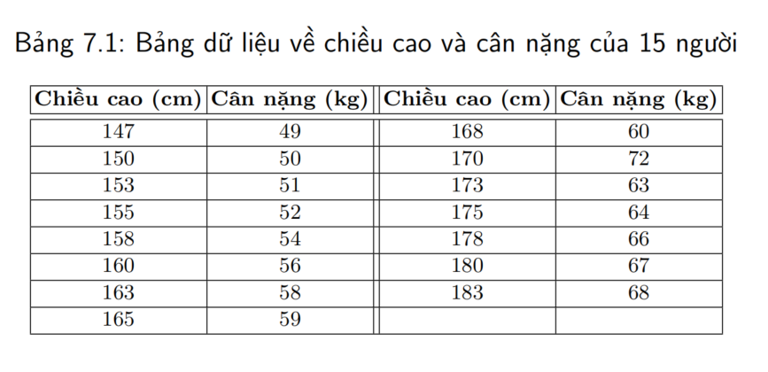

NỘI DUNG BÀI TẬP
|BT1-Linear-Regression|:

|BT2-Linear-Regression|:
Quan hệ giữa số giờ học và điểm thi
Dữ liệu:
Số giờ học (X): 2, 4, 6, 8, 10
Điểm thi (Y): 4, 7, 10, 13, 16
Yêu cầu:
1. Vẽ biểu đồ phân tán giữa X và Y.
2. Xây dựng mô hình hồi quy tuyến tính Y = β₀ + β₁X
3. Tính hệ số β₀ , β₁ bằng công thức.
4. Dự đoán điểm thi nếu học 7 giờ.

|BT3-Linear-Regression|:
Chi tiêu quảng cáo và doanh thu
Dữ liệu:
Chi quảng cáo (X): 1, 2, 3, 4, 5
Doanh thu (Y): 5, 9, 11, 15, 18
Yêu cầu:
1. Xây dựng mô hình hồi quy tuyến tính.
2. Tính R² – hệ số xác định.
3. Nhận xét mối quan hệ giữa chi quảng cáo và doanh thu.
4. Dự đoán doanh thu nếu chi 3.5 triệu